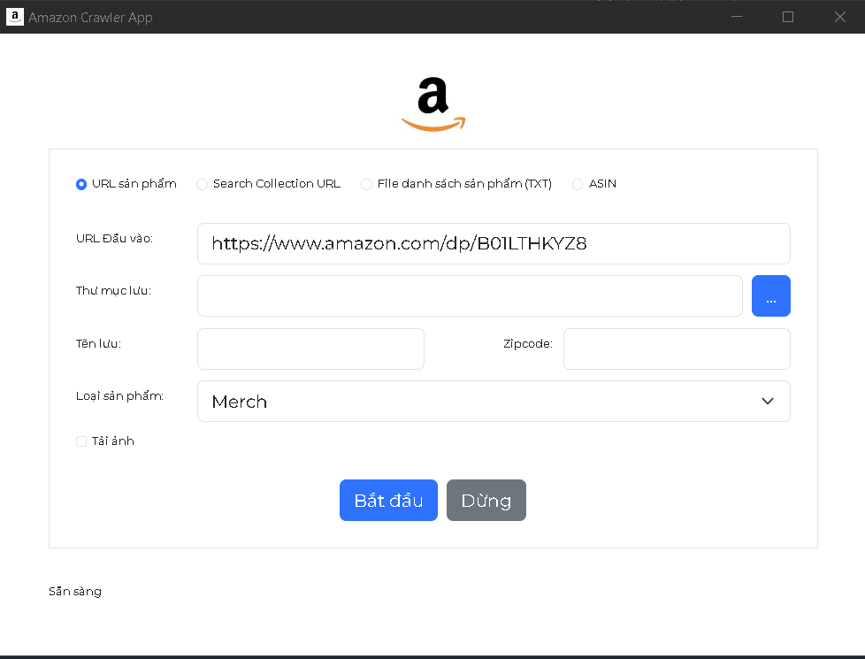

# Amazon Crawler App

A full-stack web application that crawls Amazon product data and reviews using Python Flask as the backend API and Node as the frontend.

## Overview
This project consists of two main components:

* **Backend**: A Python Flask API that crawls Amazon product data and reviews using Scrapy spiders.
* **Frontend**: A NodeJS application that consumes the backend API to display crawled data to the user.

## Features

* Scrape product data from Amazon product search pages
* Scrape product reviews from individual product pages
* Use ScrapeOps Proxy for proxy rotation and monitoring
* Use ScrapeOps Monitor for monitoring and scheduling
* NodeJS frontend to display crawled data

## Requirements

* Python 3.6+ (for backend)
* Flask 2.0+ (for backend)
* Scrapy 2.5+ (for backend)
* ScrapeOps Proxy SDK (for backend)
* ScrapeOps Monitor SDK (for backend)
* Node.js 14+ (for frontend)

## Installation

### Backend

1. Install Python dependencies: `pip install flask scrapy scrapeops-scrapy-proxy-sdk scrapeops-scrapy`
2. Install ScrapeOps Proxy SDK: `pip install scrapeops-scrapy-proxy-sdk`
3. Install ScrapeOps Monitor SDK: `pip install scrapeops-scrapy`
4. Clone this repository: `git clone https://github.com/your-username/amz_crawler.git`
5. Create a new ScrapeOps API key and add it to your `settings.py` file

### Frontend

1. Install Node.js dependencies: `npm install`
2. Clone this repository: `git clone https://github.com/your-username/amz_crawler.git`

## Usage

### Backend

1. Run the Flask API: `flask run`
2. Run the Scrapy spider: `scrapy crawl amazon_search_product`

### Frontend

1. Run the NodeJS application: `npm start`

### Run.sh

Run all file with run.sh

## Contributing

Contributions are welcome! Please submit a pull request with your changes.

## License

This project is licensed under the MIT License.